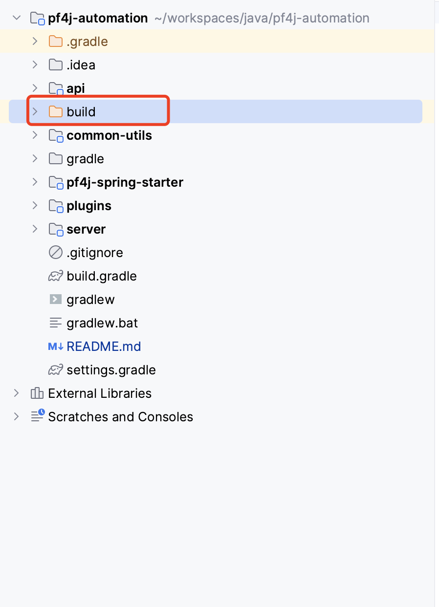

# pf4j-automation

## 文件结构介绍：

> pf4j-automation
>
> >api：接口定义：这里可以理解定义接口的规范，可以有选择的在插件中实现对应的扩展方法。
> >
> >common-utils：公共工具类。
> >
> >pf4j-spring-starter：自定义的 pf4j-spring 启动装置，在项目启动的时候，会进行加载，详情可以查看对应包内代码注释
> >
> >plugins：所有插件都将放到这个包内。
> >
> >>LoginServicePlugin：有关用户服务的插件。
> >
> >server：服务启动。

## 如何开始？

在 build 之前，请先进行 pf4j-spring-starter jar 包发布。这里发布到本地的mvn仓库里面了，发布命令：

```bash
./gradlew :pf4j-spring-starter:publishMavenPublicationToMavenLocal
```

在发布完了之后进行 build：

```bash
#build
./gradlew build
```

在 build 项目之后将会在根目录下看到对应的插件有关文件：



## 启动项目：

在启动之前，请先将 server 模块下的 application.yml 插件路径修改为你的目录！！！！详情：

```yaml
spring:
  p4fj:
    enabled: true
    path: /Users/ljackie/workspaces/java/pf4j-automation/build/plugins # 改为自己的
```

启动类 >>> server 模块：ServerBoot.java 为入口类。

## 如何测试？

打开你的请求工具：

访问 http://localhost:8080/user/login 

请求类型：POST

请求 Body: 

```json
{
  "username": "Leung",
  "password": "123456"
}
```

